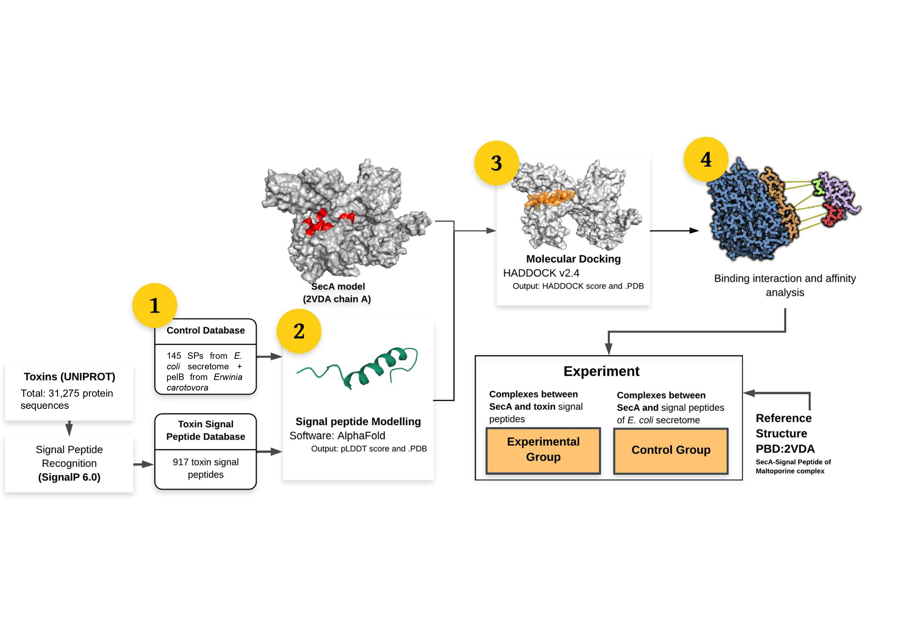
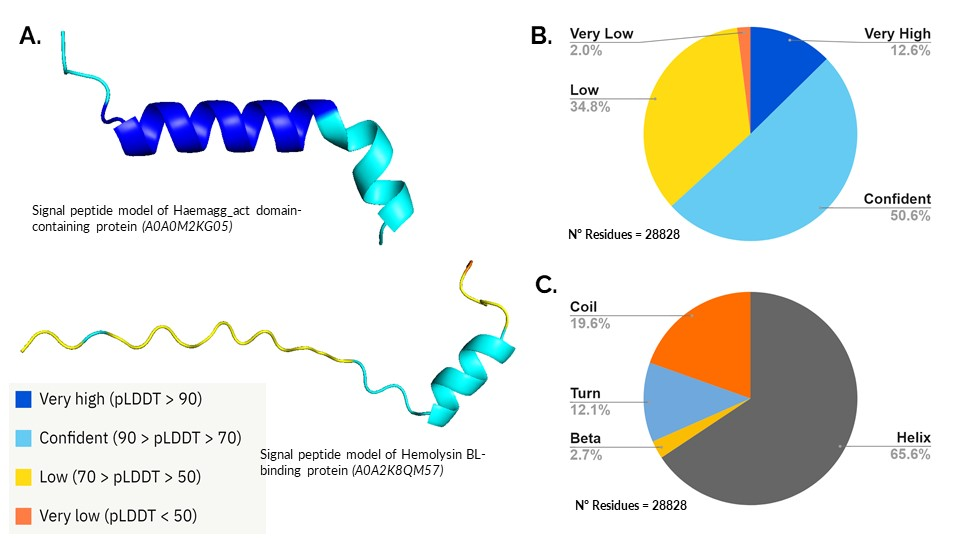

# Computational Pipeline for Identification of Secretory Peptides Interacting with SecA in *Escherichia coli*

[](https://opensource.org/licenses/MIT)

> **"Computational pipeline for in silico identification of novel secretory peptides interacting with SecA in *Escherichia coli*"**
> Jose M. Cisneros Mandujano, Arturo Nickolay Rojas-Tavara, Melissa Alegría-Arcos, Alberto Jesus Donayre-Torres
> *(journal and DOI to be added upon publication)*

---

## Overview

This repository contains the full computational pipeline, notebooks, and results for the identification and analysis of novel signal peptides (SPs) that interact with the SecA protein in *Escherichia coli*. The pipeline integrates protein sequence analysis, structural modeling with AlphaFold, molecular docking with HADDOCK, and binding interface characterization to identify and rank SP candidates for recombinant protein secretion applications.

```
Stage 1                  Stage 2                Stage 3               Stage 4
──────────────────────   ────────────────────   ───────────────────   ──────────────────────
Protein Sequence      →  Signal Peptide      →  SecA/SP Docking   →  Interface Analysis
Analysis                 Structural Modeling     (HADDOCK)             (MAPIYA +
(UniProt + SignalP)      (AlphaFold + STRIDE)                          PyDockEneRes)
```



---

## Repository Structure

```
├── notebooks/    Jupyter notebooks for each computational stage
├── data/         Input files and figures
├── outputs/      Supplementary tables and result files
```

---

## Stage 1 — Protein Sequence Analysis

### 1a. Control SP Database (*E. coli*)

**Input:** Full *E. coli* proteome from UniProt (GFF format, `taxonomy_id:562`, accessed 2024).
Reviewed UniProtKB/Swiss-Prot entries were filtered for experimentally validated Sec-pathway signal peptides (ECO:0000269), excluding Tat-dependent proteins.

> The full GFF file (49 MB) is available at Zenodo: [https://doi.org/10.5281/zenodo.10971817](https://doi.org/10.5281/zenodo.10971817)

**Notebook:** [`Stage1a_Control_SP_Extraction.ipynb`](notebooks/Stage1a_Control_SP_Extraction.ipynb)

**Output:** [`data/1.2_Input_for_uniprot_IDmapping.txt`](data/1.2_Input_for_uniprot_IDmapping.txt) — 145 UniProt IDs with SP coordinates (e.g. `P0AEG4[1-20]`). Upload to the [UniProt ID Mapping tool](https://www.uniprot.org/id-mapping) to retrieve full SP sequences in FASTA format.

The **Control SP database contains 146 sequences**: 145 experimentally validated SPs from *E. coli* + PelB from *Erwinia carotovora* (positive control). Full list: [Supplementary Table 1](outputs/SupplementaryTable1.xlsx).

### 1b. Toxin SP Database (Gram-negative bacteria)

Signal peptides from toxin proteins (GO:0003824) were retrieved from the gram-negative bacteria proteome (taxonomy: Proteobacteria) from UniProt. Both reviewed and hypothetical sequences were included.

**Input sequences:** [`data/toxin_sequences.fasta`](data/toxin_sequences.fasta)

**SignalP 6.0** was run to predict signal peptides:

```bash
signalp6 --fastafile toxin_sequences.fasta \
          --organism other \
          --output_dir Results_toxin/ \
          --format txt \
          --mode fasta
```

SignalP outputs ([`data/1.3_prediction_results_toxin.txt`](data/1.3_prediction_results_toxin.txt), [`data/1.3_signalP_output.gff3`](data/1.3_signalP_output.gff3); full JSON at Zenodo) were processed with:

**Notebook:** [`Stage1b_Toxin_SP_Database_SignalP.ipynb`](notebooks/Stage1b_Toxin_SP_Database_SignalP.ipynb)

**Output:** **917 signal peptide candidates**. Full list: [Supplementary Table 2](outputs/SupplementaryTable2.xlsx).

---

## Stage 2 — Signal Peptide Structural Modeling

### AlphaFold Modeling

All 1,063 SP sequences (146 control + 917 toxin) were modeled using **AlphaFold** via [LatchBio](https://latch.bio/). Each structure was exported in PDB format with per-residue pLDDT confidence scores.

> All 1,063 PDB models are deposited at Zenodo: [https://doi.org/10.5281/zenodo.10971817](https://doi.org/10.5281/zenodo.10971817)

### Secondary Structure Analysis (STRIDE)

**STRIDE** was applied to all SP PDB models to assign secondary structure per residue (helix, sheet, coil, turn). A total of **28,828 residues** from 917 toxin PDB models were analyzed; 65.6% showed helical conformation.

**Notebook:** [`Stage2_AlphaFold_pLDDT_STRIDE.ipynb`](notebooks/Stage2_AlphaFold_pLDDT_STRIDE.ipynb)

> STRIDE output data available at Zenodo.



---

## Stage 3 — SecA/SP Complex Prediction using HADDOCK

Interactions between SecA and each SP were predicted using **HADDOCK 2.4** ([wenmr.science.uu.nl/haddock2.4](https://wenmr.science.uu.nl/haddock2.4/)).

**Receptor:** NMR structure of SecA (PDB: **2VDA**, chain A).
**Active site residues (AIRs):** Ile225, Met235, Val239, Ile291, Met292, Ile304, Met305, Leu306, Val310, Leu372, Leu774, Met810, Met814.

Interface RMSD (iRMSD) vs. PDB:2VDA was computed using DockQ (v1.0) to select the best cluster per peptide.

**Notebook:** [`Stage3_HADDOCK_iRMSD.ipynb`](notebooks/Stage3_HADDOCK_iRMSD.ipynb)

**Output:** [Supplementary Table 3](outputs/SupplementaryTable3.xlsx) — HADDOCK scores and iRMSD for all docking models. Mean HADDOCK scores for best clusters ranged from **−184.9 to −29.9**.

---

## Stage 4 — Interface Analysis (MAPIYA + PyDockEneRes)

This stage was performed manually using web servers. Input PDB cluster files for 7 representative SPs (P28031, A0A0E1NLZ9, Q3YL96, DsbA, OmpA, PelB + PDB:2VDA reference) are available at Zenodo.

### 4a. Interface Contact Analysis (MAPIYA)

**MAPIYA** ([mapiya.lcbio.pl](https://mapiya.lcbio.pl/)) identified hydrogen bonds, salt bridges, and hydrophobic interactions in SecA/SP complexes. Only interactions present in ≥ 3 models from the best cluster were recorded.

**Output:** [Table 1](outputs/Table1_MAPIYA_results.xlsx) — MAPIYA interface contacts.

### 4b. Per-Residue Energy Contribution (PyDockEneRes)

**PyDockEneRes** ([life.bsc.es/pid/pydockeneres](https://life.bsc.es/pid/pydockeneres)) computed per-residue energy contributions (electrostatic + van der Waals + desolvation) within SecA/SP binding interfaces. Mean energy values were calculated across all models in each best cluster. The same analysis was applied to PDB:2VDA as a benchmark reference.

**Outputs:**
- [Supplementary Table 4](outputs/SupplementaryTable4.xlsx) — Per-residue energy contribution for 7 representative SecA/SP complexes
- [Supplementary Table 5](outputs/SupplementaryTable5.xlsx) — Per-residue energy contribution for PDB:2VDA reference

---

## Supplementary Tables

| Table | File | Description |
|-------|------|-------------|
| Table 1 | [Table1_MAPIYA_results.xlsx](outputs/Table1_MAPIYA_results.xlsx) | MAPIYA interface contacts — 7 representative SPs |
| Suppl. Table 1 | [SupplementaryTable1.xlsx](outputs/SupplementaryTable1.xlsx) | Control SP sequences and UniProt IDs (146 total) |
| Suppl. Table 2 | [SupplementaryTable2.xlsx](outputs/SupplementaryTable2.xlsx) | Toxin SP candidates — SignalP likelihood, sequences, UniProt IDs (917 total) |
| Suppl. Table 3 | [SupplementaryTable3.xlsx](outputs/SupplementaryTable3.xlsx) | HADDOCK score and iRMSD for all docking models |
| Suppl. Table 4 | [SupplementaryTable4.xlsx](outputs/SupplementaryTable4.xlsx) | Per-residue energy contribution — 7 SecA/SP complexes |
| Suppl. Table 5 | [SupplementaryTable5.xlsx](outputs/SupplementaryTable5.xlsx) | Per-residue energy contribution — PDB:2VDA reference |

---

## Setup & Reproducibility

```bash
conda env create -f environment.yml
conda activate signal_peptides_env
jupyter notebook
```

### External Tools (web servers — no local installation required)

| Tool | Version | URL |
|------|---------|-----|
| SignalP | 6.0 | [services.healthtech.dtu.dk](https://services.healthtech.dtu.dk/signalp) |
| AlphaFold / LatchBio | Web server | [latch.bio](https://latch.bio) |
| STRIDE | — | [webclu.bio.wzw.tum.de/stride](http://webclu.bio.wzw.tum.de/stride/) |
| HADDOCK | 2.4 | [wenmr.science.uu.nl/haddock2.4](https://wenmr.science.uu.nl/haddock2.4/) |
| MAPIYA | — | [mapiya.lcbio.pl](https://mapiya.lcbio.pl/) |
| PyDockEneRes | — | [life.bsc.es/pid/pydockeneres](https://life.bsc.es/pid/pydockeneres) |

---

## Data Availability

Large files (PDB models, STRIDE results, HADDOCK cluster PDBs, full GFF, SignalP JSON) are deposited at Zenodo:

> Alegría-Arcos, M. et al. (2024). *Computational pipeline for identification of secretory peptides interacting with SecA in E. coli* [Data set]. Zenodo.
> [https://doi.org/10.5281/zenodo.10971817](https://doi.org/10.5281/zenodo.10971817)

---

## Citation

> Cisneros Mandujano JM, Rojas-Tavara AN, Alegría-Arcos M, Donayre-Torres AJ.
> *Computational pipeline for in silico identification of novel secretory peptides interacting with SecA in Escherichia coli.* (2026).

---

## License

MIT License — see [LICENSE](LICENSE).

## Contact

**Corresponding author:** Alberto Jesus Donayre-Torres — adonayre@utec.edu.pe
CentroBIO Research Center, Universidad de Ingeniería y Tecnología (UTEC), Lima, Peru.
